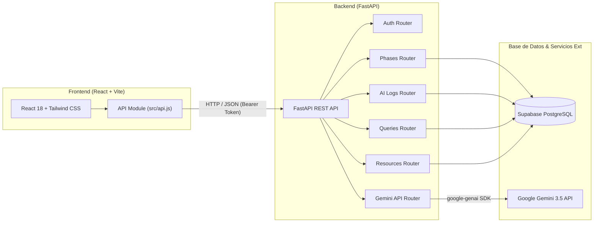

# 🎓 Herramienta de Trazabilidad y Gestión Bibliográfica para Proyectos de Grado

Plataforma Web **Full-Stack** diseñada para auditar, organizar y garantizar la transparencia académica en el proceso de investigación y redacción de proyectos de grado. Permite el seguimiento del cronograma por fases, el registro auditado de interacciones con Inteligencia Artificial, la generación asistida con **Google Gemini IA en vivo**, el almacenamiento de **Ecuaciones de Búsqueda Avanzada** (Scopus, Web of Science, IEEE Xplore) y la gestión de recursos bibliográficos.

---

## 🚀 Características Principales

### 1. 📊 Panel de Resumen (Dashboard)
- Visualización en tiempo real del porcentaje de avance global del proyecto.
- Conteo de fases completadas vs. pendientes.
- Métricas de consultas registradas en la bitácora de IA y total de ecuaciones de búsqueda guardadas.

### 2. 📅 Cronograma y Fases del Proyecto
- Gestión interactiva de las etapas del proyecto (*Definición de Objetivos*, *Revisión Bibliográfica*, *Diseño Metodológico*, *Análisis de Resultados*, etc.).
- Estados configurables: `pendiente`, `en_progreso` y `completado`.
- Asignación de fechas objetivo (*target dates*).

### 3. 🤖 Bitácora de IA (Auditoría y Transparencia Académica)
- **Asistente Gemini IA en Vivo**: Integración con la API oficial de **Google Gemini (versión 3.5)** para realizar consultas en tiempo real dentro de la aplicación.
- **Registro Automático**: Al consultar a Gemini desde la app, la instrucción (*Prompt*), la respuesta generada y la fecha se guardan **automáticamente** en la base de datos.
- **Registro Manual**: Soporte para registrar interacciones realizadas en otras herramientas de IA (*ChatGPT*, *Claude*, *Copilot*).
- **Justificación de Trazabilidad**: Campo obligatorio para indicar exactamente cómo se utilizó la respuesta en el documento final.

### 4. 🔎 Ecuaciones de Búsqueda Avanzada (Advanced Queries)
- Almacenamiento organizado de ecuaciones de búsqueda científica para **Scopus**, **Web of Science**, **IEEE Xplore**, **PubMed** y **Google Scholar**.
- **Copiado con Un solo Clic**: Botón **"Copiar Ecuación"** que copia inmediatamente la sintaxis exacta al portapapeles (`navigator.clipboard`) para pegarla directamente en los buscadores académicos.
- Registro de la cantidad de resultados obtenidos y notas del objetivo de la consulta.

### 5. 🔗 Repositorio de Recursos y Enlaces
- Gestión de enlaces a artículos en Google Scholar, carpetas compartidas de Google Drive, archivos PDF y sitios web de referencia.

### 6. 🔐 Autenticación y Seguridad
- Acceso protegido por inicio de sesión (*Login*) con usuario único compartido entre integrantes del equipo.
- Autenticación basada en **Token de Acceso (Bearer Token)** almacenado de forma persistente en la sesión.

---

## 🛠️ Arquitectura Técnica y Stack Tecnológico



### Tecnologías Utilizadas

- **Frontend**: React 18, Vite 5, Tailwind CSS, Lucide React Icons, JavaScript ES2022.
- **Backend**: Python 3.11, FastAPI, SQLAlchemy ORM, Pydantic v2, Uvicorn / Gunicorn, `google-genai` SDK.
- **Base de Datos**: PostgreSQL hosted en **Supabase** (con fallback local a SQLite).
- **Despliegue & DevOps**: Render (Web Service para Backend, Static Site para Frontend, Blueprint `render.yaml`), Vercel / Netlify.

---

## 📁 Estructura del Proyecto

```text
Gestor Bibliografico/
├── render.yaml               # Blueprint oficial de Render para despliegue automatizado
├── README.md                 # Resumen y documentación del proyecto
├── Backend/
│   ├── main.py               # Punto de entrada FastAPI, CORS y registro de routers
│   ├── database.py           # Conexión SQLAlchemy (Supabase PostgreSQL / SQLite) e init_db
│   ├── models.py             # Modelos ORM (Phase, AILog, Resource, AdvancedQuery)
│   ├── schemas.py            # Esquemas Pydantic v2 para validación y serialización
│   ├── requirements.txt      # Dependencias de Python (FastAPI, Uvicorn, Gunicorn, google-genai)
│   ├── Dockerfile            # Configuración Docker para despliegue en contenedores
│   ├── Procfile              # Comando de inicio para plataformas PaaS
│   ├── .env.example          # Plantilla de variables de entorno para el Backend
│   └── routers/
│       ├── auth.py           # Router de autenticación (/api/login)
│       ├── phases.py         # Router CRUD de fases (/api/phases)
│       ├── ai_logs.py        # Router CRUD de bitácora IA (/api/ai-logs)
│       ├── gemini.py         # Router de integración en vivo con Gemini (/api/gemini/generate)
│       ├── queries.py        # Router CRUD de ecuaciones de búsqueda (/api/queries)
│       └── resources.py      # Router CRUD de recursos (/api/resources)
└── Frontend/
    ├── index.html            # Punto de entrada HTML
    ├── vite.config.js        # Configuración de Vite y proxy local /api
    ├── vercel.json           # Configuración de reescritura SPA y encabezados MIME para Vercel
    ├── .env.example          # Plantilla de variables de entorno (VITE_API_URL)
    ├── public/
    │   ├── _redirects        # Reglas de enrutamiento SPA para Netlify/Render
    │   └── _headers          # Encabezados de tipos MIME estáticos
    └── src/
        ├── main.jsx          # Renderizado raíz de React
        ├── index.css         # Estilos globales de Tailwind CSS
        ├── api.js            # Cliente HTTP asíncrono y encabezados Bearer
        └── App.jsx           # Componente principal SPA y vistas interactivas
```

---

## ⚙️ Configuración y Ejecución Local

### Prerrequisitos
- Node.js (v18 o superior) y npm.
- Python (v3.10 o superior).

### 1. Clonar el Repositorio
```bash
git clone https://github.com/prietokenneth28-del/Gestor---Archivos-.git
cd Gestor---Archivos-
```

### 2. Configurar y Arrancar el Backend
```bash
cd Backend

# Instalar dependencias
pip install -r requirements.txt

# Crear archivo de variables de entorno
cp .env.example .env
```

Edita `.env` con tus credenciales:
```env
DB_USER=postgres.xxxxxxxx
DB_PASSWORD=tu_contraseña_supabase
DB_HOST=aws-0-us-east-1.pooler.supabase.com
DB_PORT=6543
DB_NAME=postgres
GEMINI_API_KEY=tu_clave_api_gemini
AUTH_USERNAME=admin
AUTH_PASSWORD=trazabilidad2026
```

Ejecuta el servidor de desarrollo:
```bash
python main.py
```
*El servidor iniciará en `http://127.0.0.1:8000` con documentación interactiva Swagger en `/docs`.*

### 3. Configurar y Arrancar el Frontend
En otra terminal:
```bash
cd Frontend

# Instalar dependencias
npm install

# Iniciar servidor de desarrollo
npm run dev
```
*La aplicación estará accesible en `http://localhost:3000`.*

---

## ☁️ Despliegue en Producción (Render)

El proyecto incluye la plantilla oficial **`render.yaml`** (Blueprint) en la raíz. Para desplegar en Render:

1. Inicia sesión en [Render.com](https://render.com).
2. Ve a **Blueprints** -> **New Blueprint Instance**.
3. Conecta tu repositorio de GitHub.
4. Render creará automáticamente:
   - El **Web Service** para el Backend (`Backend/` con Python/Gunicorn).
   - El **Static Site** para el Frontend (`Frontend/` con `npm run build` y directorio de publicación `dist`).
5. Configura las variables de entorno `DB_USER`, `DB_PASSWORD`, `DB_HOST`, `DB_PORT`, `DB_NAME` y `GEMINI_API_KEY` en la consola de Render.

---

## 👥 Credenciales de Acceso por Defecto

- **Usuario**: `admin`
- **Contraseña**: `trazabilidad2026`

---

## 📜 Licencia

Desarrollado para el proyecto de grado del programa de Ingeniería de Sistemas - **Universidad Distrital Francisco José de Caldas**.
